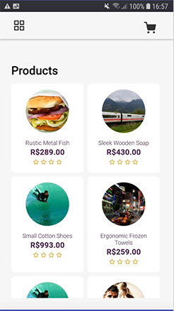
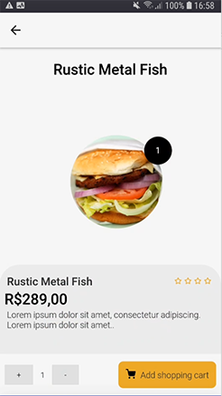
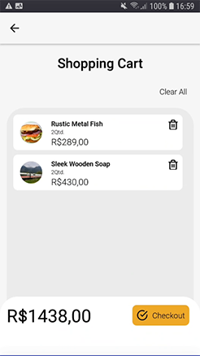

# Shopping Cart - App

Loja simples em React Native (Typescript), com um catálogo de produtos e um carrinho de compras. O usuário escolhe o item adicionar/remover produtos do catálogo no carrinho de compras.

## Screenshots

## Bibliotecas utilizadas

- [Axios](https://www.npmjs.com/package/axios)
- [Redux](https://redux.js.org/)
- [React Navigation](https://reactnavigation.org/)
- [React Native Vector Icons](https://github.com/oblador/react-native-vector-icons)
- [Async Storage](https://github.com/react-native-async-storage/async-storage)

## Templete
Templete utilizado como exemplo para desenvolvimento do front da aplicação [Figma](https://www.figma.com/file/HkmFmwdGeo8cHuQfKyQ2Uk/Shopping-Cart).
